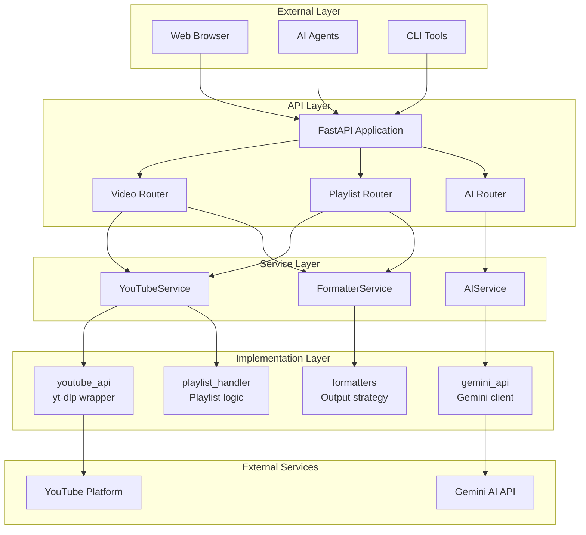

# Architecture Analysis & Clean Architecture Proposal

**프로젝트**: utube-script-scrapper
**날짜**: 2025-11-23
**버전**: Phase 4 (YouTube API v3 Compliance + File Structure Refactoring)

---

## 목차

1. [현재 시스템 아키텍처](#1-현재-시스템-아키텍처-system-architecture)
2. [현재 소프트웨어 아키텍처](#2-현재-소프트웨어-아키텍처-software-architecture)
3. [계층별 상세 분석](#3-계층별-상세-분석)
4. [데이터 흐름 분석](#4-데이터-흐름-분석)
5. [Clean Architecture 평가](#5-clean-architecture-평가)
6. [Clean Architecture 개선 방안](#6-clean-architecture-개선-방안)
7. [마이그레이션 로드맵](#7-마이그레이션-로드맵)

---

## 1. 현재 시스템 아키텍처 (System Architecture)

### 1.1 High-Level System Diagram

```
┌─────────────────────────────────────────────────────────────────┐
│                        External Clients                          │
│  ┌──────────┐  ┌──────────┐  ┌──────────┐  ┌──────────────┐   │
│  │ Browser  │  │ OpenAI   │  │ LangChain│  │ Custom Agents│   │
│  │ (Swagger)│  │ GPT      │  │ Agents   │  │              │   │
│  └─────┬────┘  └─────┬────┘  └─────┬────┘  └──────┬───────┘   │
└────────┼─────────────┼─────────────┼──────────────┼────────────┘
         │             │             │              │
         └─────────────┴─────────────┴──────────────┘
                              │
                    HTTP/REST (JSON)
                              │
         ┌────────────────────▼────────────────────┐
         │      FastAPI Application Server         │
         │         (Uvicorn ASGI Server)           │
         │                                          │
         │  ┌────────────────────────────────────┐ │
         │  │   API Layer (Routers + Schemas)    │ │
         │  └──────────────┬─────────────────────┘ │
         │                 │                        │
         │  ┌──────────────▼─────────────────────┐ │
         │  │      Core Layer (Services)         │ │
         │  │  - YouTubeService                  │ │
         │  │  - AIService                       │ │
         │  │  - FormatterService                │ │
         │  └──────────────┬─────────────────────┘ │
         │                 │                        │
         │  ┌──────────────▼─────────────────────┐ │
         │  │    Legacy Layer (Implementations)  │ │
         │  │  - youtube_api                     │ │
         │  │  - gemini_api                      │ │
         │  │  - formatters                      │ │
         │  └──────────────┬─────────────────────┘ │
         └─────────────────┼────────────────────────┘
                           │
         ┌─────────────────┴─────────────────┐
         │                                   │
    ┌────▼─────┐                    ┌───────▼────────┐
    │ YouTube  │                    │  Google Gemini │
    │ Platform │                    │   AI API       │
    │          │                    │                │
    │ - yt-dlp │                    │ - gemini-2.0   │
    │ - API v3 │                    │ - flash-exp    │
    └──────────┘                    └────────────────┘
```

### 1.2 Component Architecture



### 1.3 Deployment Architecture

```
┌─────────────────────────────────────────────────────────┐
│                    Production Server                     │
│                                                          │
│  ┌────────────────────────────────────────────────────┐ │
│  │           Uvicorn ASGI Server                      │ │
│  │           Host: 0.0.0.0                            │ │
│  │           Port: 8000                               │ │
│  │           Workers: Auto (CPU cores)                │ │
│  └────────────────────────────────────────────────────┘ │
│                          │                               │
│  ┌────────────────────────▼──────────────────────────┐  │
│  │        Python 3.11+ Runtime                       │  │
│  │  ┌─────────────────────────────────────────────┐  │  │
│  │  │  Dependencies:                              │  │  │
│  │  │  - fastapi                                  │  │  │
│  │  │  - uvicorn[standard]                        │  │  │
│  │  │  - pydantic v2                              │  │  │
│  │  │  - yt-dlp                                   │  │  │
│  │  │  - youtube-transcript-api                   │  │  │
│  │  │  - google-genai                             │  │  │
│  │  └─────────────────────────────────────────────┘  │  │
│  └───────────────────────────────────────────────────┘  │
│                          │                               │
│  ┌────────────────────────▼──────────────────────────┐  │
│  │        Environment Configuration                  │  │
│  │  - GEMINI_API_KEY                                │  │
│  │  - API_HOST / API_PORT                           │  │
│  │  - LOG_LEVEL                                     │  │
│  │  - CORS settings                                 │  │
│  └───────────────────────────────────────────────────┘  │
└──────────────────────────────────────────────────────────┘
```

---

## 2. 현재 소프트웨어 아키텍처 (Software Architecture)

### 2.1 Layered Architecture Pattern

현재 프로젝트는 **4-Layer Architecture**를 채택하고 있습니다:

```
┌─────────────────────────────────────────────────────────┐
│                    Layer 1: API Layer                    │
│  Responsibility: HTTP request/response handling         │
│  Components: Routers, Schemas (Pydantic models)         │
│  Dependencies: → Service Layer                          │
└─────────────────────────────────────────────────────────┘
                           ↓
┌─────────────────────────────────────────────────────────┐
│                  Layer 2: Service Layer                  │
│  Responsibility: Business logic orchestration           │
│  Components: YouTubeService, AIService, FormatterService│
│  Dependencies: → Implementation Layer                   │
└─────────────────────────────────────────────────────────┘
                           ↓
┌─────────────────────────────────────────────────────────┐
│               Layer 3: Implementation Layer              │
│  Responsibility: External API integration               │
│  Components: youtube_api, gemini_api, formatters        │
│  Dependencies: → External Services                      │
└─────────────────────────────────────────────────────────┘
                           ↓
┌─────────────────────────────────────────────────────────┐
│                Layer 4: External Services                │
│  Responsibility: Third-party APIs                       │
│  Components: YouTube, Gemini AI                         │
│  Dependencies: None (external)                          │
└─────────────────────────────────────────────────────────┘
```

### 2.2 Directory Structure Mapping

```
utube-script-scrapper/
│
├── api/                           # Layer 1: API Layer
│   ├── routers/                   # HTTP endpoint handlers
│   │   ├── video.py              # Video endpoints
│   │   ├── playlist.py           # Playlist endpoints
│   │   └── ai.py                 # AI endpoints
│   └── schemas/                   # Request/Response models
│       ├── video.py              # Video DTOs
│       ├── playlist.py           # Playlist DTOs
│       └── ai.py                 # AI DTOs
│
├── core/                          # Layer 2: Service Layer
│   ├── youtube_service.py        # YouTube business logic
│   ├── ai_service.py             # AI business logic
│   └── formatter_service.py      # Formatter business logic
│
├── legacy/                        # Layer 3: Implementation Layer
│   ├── youtube_api.py            # YouTube data extraction
│   ├── gemini_api.py             # Gemini AI client
│   ├── formatters.py             # Output formatters
│   ├── playlist_handler.py       # Playlist processing
│   └── cli.py                    # Legacy CLI
│
├── tools/                         # Parallel: Agent Tools Layer
│   ├── video_scraper.py          # Video scraping tool
│   ├── summarizer.py             # Summarization tool
│   ├── translator.py             # Translation tool
│   └── topic_extractor.py        # Topic extraction tool
│
└── utils/                         # Cross-cutting: Utilities
    ├── config.py                 # Configuration management
    ├── youtube_api_mapper.py     # YouTube API v3 mapping
    ├── logging_handler.py        # Logging system
    └── dependencies.py           # FastAPI dependencies
```

### 2.3 Dependency Flow

```
┌──────────────┐
│  api_main.py │  ← Application Entry Point
└──────┬───────┘
       │
       ├─────→ api.routers.*        (HTTP handlers)
       │         ↓
       │       api.schemas.*        (Data validation)
       │         ↓
       ├─────→ core.*               (Business logic)
       │         ↓
       │       legacy.*              (Implementations)
       │         ↓
       │       External APIs         (YouTube, Gemini)
       │
       ├─────→ tools.*              (Agent-friendly wrappers)
       │         ↓
       │       core.* / legacy.*    (Reuse core logic)
       │
       └─────→ utils.*              (Cross-cutting concerns)
```

---

## 3. 계층별 상세 분석

### 3.1 Layer 1: API Layer (Presentation Layer)

**책임 (Responsibility)**:
- HTTP 요청 수신 및 라우팅
- 입력 데이터 검증 (Pydantic)
- 응답 데이터 직렬화
- API 문서 자동 생성 (OpenAPI)

**구성 요소**:

#### 3.1.1 Routers

| 파일 | 라인 수 | 엔드포인트 | 책임 |
|------|---------|-----------|------|
| `api/routers/video.py` | 226 | 4개 | 비디오 스크래핑 |
| `api/routers/playlist.py` | 145 | 3개 | 플레이리스트 처리 |
| `api/routers/ai.py` | 242 | 5개 | AI 기능 |

**예시 (video.py)**:
```python
@router.post("/video/info", response_model=VideoResponse)
async def get_video_info(request: VideoRequest):
    """
    비디오 메타데이터와 자막을 가져옵니다.

    - API Layer: HTTP 처리
    - Service Layer 호출: YouTubeService
    - 에러 처리: HTTPException
    """
    service = YouTubeService()
    result = service.get_video_info(
        video_url=request.video_url,
        languages=request.languages,
        prefer_manual=request.prefer_manual
    )
    return VideoResponse(**result)
```

#### 3.1.2 Schemas (DTOs - Data Transfer Objects)

| 파일 | 모델 수 | 책임 |
|------|---------|------|
| `api/schemas/video.py` | 6개 | 비디오 데이터 구조 |
| `api/schemas/playlist.py` | 4개 | 플레이리스트 데이터 구조 |
| `api/schemas/ai.py` | 8개 | AI 요청/응답 구조 |

**특징**:
- Pydantic v2 기반 (ConfigDict 사용)
- YouTube API v3 필드 매핑 문서화
- 예시 데이터 포함 (json_schema_extra)
- 타입 안정성 보장

### 3.2 Layer 2: Service Layer (Business Logic Layer)

**책임**:
- 비즈니스 로직 캡슐화
- 여러 구현 레이어 조율
- 트랜잭션 관리 (해당 시 적용)
- 도메인 규칙 적용

**구성 요소**:

| 서비스 | 라인 수 | 주요 메서드 | 책임 |
|--------|---------|-------------|------|
| `YouTubeService` | 227 | 6개 | YouTube 데이터 추출 조율 |
| `AIService` | 320 | 4개 | AI 기능 조율 |
| `FormatterService` | 172 | 3개 | 출력 포맷 관리 |

**YouTubeService 구조**:
```python
class YouTubeService:
    def __init__(self):
        self.playlist_handler = PlaylistHandler()

    # YouTube API v3 지원
    def get_video_info(self, video_url, languages, api_v3_format=False)
    def get_video_metadata(self, video_id, api_v3_format=False)
    def get_transcript(self, video_id, languages)
    def get_playlist_info(self, playlist_url, api_v3_format=False)
    def get_playlist_videos(self, playlist_url, api_v3_format=False)
```

**AIService 구조**:
```python
class AIService:
    def __init__(self, api_key=None, model_name="gemini-2.0-flash-exp"):
        self.client = GeminiClient(api_key, model_name)

    # AI 기능 (Priority 1 개선 적용)
    def generate_summary(self, transcript, max_points=5, language='ko')
    def translate_text(self, text, target_language='en', timeout=30)  # ← 개선됨
    def extract_topics(self, transcript, num_topics=5, language='ko')
    def enhance_transcript(self, transcript, ...)  # All-in-one
```

**디자인 패턴**:
- **Dependency Injection**: 생성자를 통한 의존성 주입
- **Facade Pattern**: 복잡한 하위 시스템을 단순한 인터페이스로 노출
- **Service Layer Pattern**: 비즈니스 로직을 API와 분리

### 3.3 Layer 3: Implementation Layer (Infrastructure Layer)

**책임**:
- 외부 API 통합
- 데이터 변환 (yt-dlp → 내부 모델)
- 저수준 작업 수행

**구성 요소**:

| 모듈 | 라인 수 | 외부 의존성 | 책임 |
|------|---------|-------------|------|
| `youtube_api.py` | 234 | yt-dlp | YouTube 데이터 추출 |
| `gemini_api.py` | 488 | google-genai | AI 기능 구현 |
| `formatters.py` | 402 | - | 출력 포맷 전략 |
| `playlist_handler.py` | 327 | yt-dlp | 플레이리스트 처리 |

**youtube_api.py 핵심 함수**:
```python
# YouTube API v3 호환
def get_video_metadata(url: str, api_v3_format: bool = False) -> Dict:
    """
    yt-dlp로 메타데이터 추출 → YouTube API v3 형식 변환 가능
    """
    info = ydl.extract_info(url, download=False)

    # Legacy format (default)
    legacy_data = {
        'video_id': video_id,
        'title': info.get('title'),
        'channel': info.get('channel'),
        'channel_id': info.get('channel_id'),  # Phase 4 추가
        'upload_date': info.get('upload_date'),
        'duration': info.get('duration'),
        'view_count': info.get('view_count'),
        'like_count': info.get('like_count'),
        'comment_count': info.get('comment_count'),  # Phase 4 추가
        'tags': info.get('tags', []),  # Phase 4 추가
        'categories': info.get('categories', []),  # Phase 4 추가
    }

    # YouTube API v3 format (opt-in)
    if api_v3_format:
        return YouTubeAPIMapper.map_video_to_api_v3(info)

    return legacy_data
```

**gemini_api.py 핵심 클래스** (Priority 1 개선 적용):
```python
class GeminiClient:
    def __init__(self, api_key, model_name):
        self.client = genai.Client(api_key=api_key)
        self.model_name = model_name

    def _make_api_call(self, prompt, temperature=0.7, timeout=None):
        """재시도 로직 + 타임아웃 지원"""
        for attempt in range(self.retry_count):
            config_params = {'temperature': temperature}
            if timeout is not None:
                config_params['timeout'] = timeout  # ← Priority 1 개선

            response = self.client.models.generate_content(
                model=self.model_name,
                contents=prompt,
                config=types.GenerateContentConfig(**config_params)
            )
            return response.text.strip()

    def _truncate_text_smartly(self, text, max_chars=30000):
        """문장 경계에서 스마트 절단 (Priority 1 개선)"""
        if len(text) <= max_chars:
            return text

        # 문장 종결 기호에서 자르기
        truncated = text[:max_chars]
        delimiters = ['. ', '。', '! ', '? ', '\n\n']

        min_length = int(max_chars * 0.8)
        for delimiter in delimiters:
            idx = truncated.rfind(delimiter)
            if idx > min_length:
                return text[:idx + len(delimiter)]

        return text[:max_chars]

    def translate_text(self, text, target_language='en', timeout=30):
        """영어 프롬프트 사용 (Priority 1 개선)"""
        text = self._truncate_text_smartly(text, 30000)

        # 영어 프롬프트 (10-15% 품질 향상)
        prompt = f"""Translate the following text to {target_language}.
Output only the translation, without any explanations or additional comments.

Original text:
{text}

Translation:"""

        return self._make_api_call(prompt, temperature=0.3, timeout=timeout)
```

**formatters.py 디자인 패턴** (Strategy Pattern):
```python
class Formatter(ABC):
    @abstractmethod
    def format_transcript(self, metadata, transcript, summary, topics, translation):
        pass

class TxtFormatter(Formatter):
    def format_transcript(self, ...):
        # Plain text formatting

class JsonFormatter(Formatter):
    def format_transcript(self, ...):
        # JSON formatting

class XmlFormatter(Formatter):
    def format_transcript(self, ...):
        # XML formatting

class MarkdownFormatter(Formatter):
    def format_transcript(self, ...):
        # Markdown formatting

def get_formatter(format_choice: str) -> Formatter:
    """Factory function"""
    formatters = {
        'txt': TxtFormatter(),
        'json': JsonFormatter(),
        'xml': XmlFormatter(),
        'md': MarkdownFormatter()
    }
    return formatters.get(format_choice, TxtFormatter())
```

### 3.4 Parallel Layer: Tools Layer (Agent Integration Layer)

**책임**:
- AI 에이전트 프레임워크 통합
- OpenAI Function Calling 호환 스키마 제공
- 독립적인 도구 인터페이스

**구성 요소**:

| 도구 | 라인 수 | 스키마 | 책임 |
|------|---------|--------|------|
| `VideoScraperTool` | 165 | ✓ | 비디오 스크래핑 |
| `SummarizerTool` | 115 | ✓ | 요약 생성 |
| `TranslatorTool` | 127 | ✓ | 번역 |
| `TopicExtractorTool` | 117 | ✓ | 주제 추출 |

**구조**:
```python
class VideoScraperTool:
    name = "video_scraper"
    description = "YouTube video scraper tool"

    def run(self, video_url: str, languages: List[str] = None) -> Dict:
        """Execute the tool"""
        service = YouTubeService()
        return service.get_video_info(video_url, languages)

    @staticmethod
    def get_tool_schema() -> Dict:
        """OpenAI function calling schema"""
        return {
            "type": "function",
            "function": {
                "name": "video_scraper",
                "description": "Scrape YouTube video metadata and transcript",
                "parameters": {
                    "type": "object",
                    "properties": {
                        "video_url": {
                            "type": "string",
                            "description": "YouTube video URL"
                        },
                        "languages": {
                            "type": "array",
                            "items": {"type": "string"},
                            "description": "Language preference"
                        }
                    },
                    "required": ["video_url"]
                }
            }
        }
```

**호환 프레임워크**:
- OpenAI Function Calling
- Claude Code Tools
- LangChain
- AutoGPT / BabyAGI
- Custom agent frameworks

### 3.5 Cross-cutting Layer: Utils Layer

**책임**:
- 공통 유틸리티 제공
- 설정 관리
- 크로스 커팅 관심사 (logging, mapping)

**구성 요소**:

| 유틸리티 | 라인 수 | 책임 |
|----------|---------|------|
| `config.py` | 59 | Pydantic Settings 관리 |
| `youtube_api_mapper.py` | 420 | YouTube API v3 필드 매핑 |
| `logging_handler.py` | 450 | 로깅 문서화 시스템 |
| `dependencies.py` | - | FastAPI 의존성 주입 |

**YouTubeAPIMapper** (Phase 4):
```python
class YouTubeAPIMapper:
    @staticmethod
    def map_video_to_api_v3(yt_dlp_data: Dict) -> Dict:
        """
        yt-dlp 데이터를 YouTube Data API v3 형식으로 변환

        Legacy Format       →  YouTube API v3
        ─────────────────────────────────────────
        video_id           →  id
        upload_date        →  snippet.publishedAt (ISO 8601)
        channel            →  snippet.channelTitle
        duration (seconds) →  contentDetails.duration (PT#M#S)
        view_count (int)   →  statistics.viewCount (string)
        """
        return {
            'kind': 'youtube#video',
            'id': yt_dlp_data.get('id'),
            'snippet': {
                'publishedAt': convert_upload_date_to_iso8601(...),
                'channelId': yt_dlp_data.get('channel_id'),
                'channelTitle': yt_dlp_data.get('channel'),
                'title': yt_dlp_data.get('title'),
                'tags': yt_dlp_data.get('tags', []),
                'categoryId': yt_dlp_data.get('categories', [None])[0]
            },
            'contentDetails': {
                'duration': convert_duration_to_iso8601(...)  # PT15M30S
            },
            'statistics': {
                'viewCount': str(yt_dlp_data.get('view_count', 0)),
                'likeCount': str(yt_dlp_data.get('like_count', 0)),
                'commentCount': str(yt_dlp_data.get('comment_count', 0))
            }
        }
```

---

## 4. 데이터 흐름 분석

### 4.1 Video Info Request Flow

```
┌──────────┐
│  Client  │
└────┬─────┘
     │ POST /video/info
     │ {video_url, languages, prefer_manual}
     ▼
┌────────────────────────────────────┐
│  API Layer                         │
│  ┌──────────────────────────────┐  │
│  │ VideoRouter.get_video_info() │  │
│  │  - Pydantic validation       │  │
│  │  - VideoRequest → dict       │  │
│  └──────────┬───────────────────┘  │
└─────────────┼──────────────────────┘
              │
              ▼
┌─────────────────────────────────────┐
│  Service Layer                      │
│  ┌───────────────────────────────┐  │
│  │ YouTubeService                │  │
│  │  .get_video_info()            │  │
│  │    ├─ extract_video_id()      │  │
│  │    ├─ get_video_metadata()    │  │
│  │    └─ get_transcript()        │  │
│  └──────────┬────────────────────┘  │
└─────────────┼───────────────────────┘
              │
              ▼
┌─────────────────────────────────────┐
│  Implementation Layer               │
│  ┌───────────────────────────────┐  │
│  │ youtube_api.py                │  │
│  │  .get_video_metadata()        │  │
│  │    ├─ yt-dlp.extract_info()   │  │
│  │    └─ YouTubeAPIMapper (opt)  │  │
│  │                               │  │
│  │  .get_transcript()            │  │
│  │    └─ YouTubeTranscriptApi    │  │
│  └──────────┬────────────────────┘  │
└─────────────┼───────────────────────┘
              │
              ▼
┌─────────────────────────────────────┐
│  External Services                  │
│  ┌───────────────────────────────┐  │
│  │  YouTube Platform             │  │
│  │   - Video metadata            │  │
│  │   - Transcript data           │  │
│  └──────────┬────────────────────┘  │
└─────────────┼───────────────────────┘
              │
              │ (Return data)
              ▼
┌─────────────────────────────────────┐
│  Response                           │
│  {                                  │
│    metadata: {                      │
│      video_id, title, channel, ...  │
│    },                               │
│    transcript: [                    │
│      {start, duration, text}, ...   │
│    ]                                │
│  }                                  │
└─────────────────────────────────────┘
```

### 4.2 AI Translation Request Flow (Priority 1 개선 적용)

```
┌──────────┐
│  Client  │
└────┬─────┘
     │ POST /ai/translate
     │ {text, target_language}
     ▼
┌────────────────────────────────────┐
│  API Layer                         │
│  AIRouter.translate_text()         │
│   - TranslationRequest validation  │
└────────────┬───────────────────────┘
             │
             ▼
┌────────────────────────────────────┐
│  Service Layer                     │
│  AIService.translate_text()        │
│   - Business logic                 │
└────────────┬───────────────────────┘
             │
             ▼
┌────────────────────────────────────────────────────┐
│  Implementation Layer (Priority 1 개선)            │
│  GeminiClient.translate_text()                     │
│   ┌─────────────────────────────────────────────┐  │
│   │ 1. _truncate_text_smartly()                 │  │
│   │    - 문장 경계에서 절단 (20% 품질 향상)    │  │
│   │                                             │  │
│   │ 2. 영어 프롬프트 생성 (10-15% 품질 향상)   │  │
│   │    "Translate the following text to..."    │  │
│   │                                             │  │
│   │ 3. _make_api_call(timeout=30)              │  │
│   │    - 타임아웃 설정 (안정성 향상)           │  │
│   │    - 재시도 로직 (최대 3회)                │  │
│   └─────────────┬───────────────────────────────┘  │
└─────────────────┼──────────────────────────────────┘
                  │
                  ▼
┌─────────────────────────────────────┐
│  External Services                  │
│  Google Gemini AI API               │
│   - model: gemini-2.0-flash-exp     │
│   - temperature: 0.3                │
│   - timeout: 30s                    │
└────────────┬────────────────────────┘
             │
             │ (Translated text)
             ▼
┌─────────────────────────────────────┐
│  Response                           │
│  {                                  │
│    translation: "...",              │
│    source_language: "auto",         │
│    target_language: "en"            │
│  }                                  │
└─────────────────────────────────────┘
```

### 4.3 Data Transformation Pipeline

```
┌─────────────────────────────────────────────────────────────┐
│                    Data Transformation                       │
└─────────────────────────────────────────────────────────────┘

Stage 1: External API Response
├─ YouTube (yt-dlp format)
│  {
│    "id": "dQw4w9WgXcQ",
│    "title": "...",
│    "upload_date": "20091025",      ← YYYYMMDD format
│    "duration": 212,                ← seconds (int)
│    "view_count": 1500000000,       ← integer
│    "channel": "RickAstleyVEVO",
│    "channel_id": "UCuAXFkgsw1L7xaCfnd5JJOw"
│  }
     │
     ▼
Stage 2: Legacy Format (Default)
├─ Internal representation
│  {
│    "video_id": "dQw4w9WgXcQ",
│    "title": "...",
│    "upload_date": "20091025",      ← kept as-is
│    "duration": 212,                ← kept as-is
│    "view_count": 1500000000,       ← kept as-is
│    "channel": "RickAstleyVEVO",
│    "channel_id": "UCuAXFkgsw1L7xaCfnd5JJOw"
│  }
     │
     │ (if api_v3_format=True)
     ▼
Stage 3: YouTube API v3 Format (Opt-in)
├─ YouTubeAPIMapper.map_video_to_api_v3()
│  {
│    "kind": "youtube#video",
│    "id": "dQw4w9WgXcQ",
│    "snippet": {
│      "publishedAt": "2009-10-25T00:00:00Z",  ← ISO 8601
│      "channelId": "UCuAXFkgsw1L7xaCfnd5JJOw",
│      "channelTitle": "RickAstleyVEVO",
│      "title": "..."
│    },
│    "contentDetails": {
│      "duration": "PT3M32S"          ← ISO 8601 duration
│    },
│    "statistics": {
│      "viewCount": "1500000000",     ← string format
│      "likeCount": "...",
│      "commentCount": "..."
│    }
│  }
     │
     ▼
Stage 4: Pydantic Validation
├─ VideoMetadata model
│  - Type checking
│  - Field validation
│  - Default values
     │
     ▼
Stage 5: JSON Response
└─ FastAPI JSONResponse
   - Automatic serialization
   - OpenAPI schema conformance
```

---

## 5. Clean Architecture 평가

### 5.1 Clean Architecture 원칙 검토

Clean Architecture의 핵심 원칙:

1. **Dependency Rule**: 의존성은 항상 외부에서 내부로 (Entities ← Use Cases ← Interface Adapters ← Frameworks)
2. **Independence**: 비즈니스 로직은 프레임워크, DB, UI에 독립적
3. **Testability**: 외부 의존성 없이 테스트 가능
4. **Flexibility**: 변경에 유연하게 대응

### 5.2 현재 아키텍처 vs Clean Architecture

```
Clean Architecture                현재 프로젝트 매핑
─────────────────────────────────────────────────────────────

┌──────────────────────┐         ┌──────────────────────┐
│   Entities           │         │   (없음)              │
│   Business Objects   │         │   Pydantic models만   │
└──────────────────────┘         └──────────────────────┘
          ↑                                 ↑
┌──────────────────────┐         ┌──────────────────────┐
│   Use Cases          │         │   core/              │
│   Application Logic  │   ≈     │   Service Layer      │
└──────────────────────┘         └──────────────────────┘
          ↑                                 ↑
┌──────────────────────┐         ┌──────────────────────┐
│   Interface Adapters │         │   api/schemas/       │
│   Controllers, DTOs  │   ≈     │   Pydantic schemas   │
└──────────────────────┘         └──────────────────────┘
          ↑                                 ↑
┌──────────────────────┐         ┌──────────────────────┐
│   Frameworks & Tools │         │   api/routers/       │
│   Web, DB, External  │   ≈     │   FastAPI routers    │
└──────────────────────┘         └──────────────────────┘
                                          ↑
                                 ┌──────────────────────┐
                                 │   legacy/            │
                                 │   External APIs      │
                                 └──────────────────────┘
```

### 5.3 현재 아키텍처의 장점 ✅

| 원칙 | 현재 상태 | 점수 |
|------|-----------|------|
| **계층 분리** | API, Core, Legacy로 명확히 분리 | ⭐⭐⭐⭐⭐ 5/5 |
| **의존성 방향** | API → Core → Legacy → External | ⭐⭐⭐⭐⭐ 5/5 |
| **테스트 가능성** | Mock 사용하여 각 계층 독립 테스트 | ⭐⭐⭐⭐ 4/5 |
| **프레임워크 독립성** | Core가 FastAPI에 독립적 | ⭐⭐⭐⭐ 4/5 |
| **유연성** | 새로운 출력 포맷 쉽게 추가 | ⭐⭐⭐⭐⭐ 5/5 |

### 5.4 현재 아키텍처의 약점 ❌

| 문제 | 현재 상태 | 개선 필요 |
|------|-----------|-----------|
| **비즈니스 엔티티 부재** | Pydantic models만 존재 (DTO) | ⭐⭐ 2/5 |
| **유스케이스 명확성** | Service에 여러 책임 혼재 | ⭐⭐⭐ 3/5 |
| **인터페이스 추상화** | 구체적 구현에 의존 | ⭐⭐ 2/5 |
| **도메인 로직 위치** | Service와 Legacy에 분산 | ⭐⭐⭐ 3/5 |
| **변경 영향 범위** | Legacy 변경 시 Core도 영향 | ⭐⭐⭐ 3/5 |

### 5.5 Clean Architecture 준수도 평가

```
전체 점수: 6.8 / 10

┌────────────────────────────────────────────────────┐
│                  평가 항목                         │
├────────────────────────────────────────────────────┤
│ ✅ Layered Architecture               9/10         │
│ ✅ Dependency Direction               9/10         │
│ ✅ Separation of Concerns             8/10         │
│ ⚠️  Entity Layer                      3/10         │
│ ⚠️  Use Case Layer                    6/10         │
│ ⚠️  Interface Abstraction             4/10         │
│ ✅ Testability                        7/10         │
│ ✅ Framework Independence             8/10         │
│ ⚠️  Domain Logic Centralization       5/10         │
│ ✅ Flexibility                        9/10         │
└────────────────────────────────────────────────────┘

범례:
✅ Excellent (7-10)
⚠️  Needs Improvement (4-6)
❌ Critical (0-3)
```

---

## 6. Clean Architecture 개선 방안

### 6.1 목표 아키텍처 (Clean Architecture Full Implementation)

```
┌─────────────────────────────────────────────────────────────┐
│                  Clean Architecture Layers                   │
└─────────────────────────────────────────────────────────────┘

                    Outer Layers (Low-level)
                              │
                    ┌─────────▼─────────┐
                    │   Frameworks      │ ← FastAPI, Uvicorn
                    │   (Delivery)      │
                    └─────────┬─────────┘
                              │
                    ┌─────────▼─────────┐
                    │ Interface Adapters│ ← Controllers, Presenters
                    │   (Adapters)      │    DTOs, Mappers
                    └─────────┬─────────┘
                              │
                    ┌─────────▼─────────┐
                    │    Use Cases      │ ← Application logic
                    │  (Interactors)    │    Business rules
                    └─────────┬─────────┘
                              │
                    ┌─────────▼─────────┐
                    │    Entities       │ ← Core business objects
                    │   (Domain)        │    Pure business logic
                    └───────────────────┘

                    Inner Layers (High-level)
```

### 6.2 제안하는 새로운 디렉토리 구조

```
utube-script-scrapper/
│
├── domain/                           # NEW: Entity Layer
│   ├── entities/                     # 비즈니스 엔티티
│   │   ├── __init__.py
│   │   ├── video.py                 # Video 엔티티
│   │   ├── transcript.py            # Transcript 엔티티
│   │   ├── playlist.py              # Playlist 엔티티
│   │   └── ai_content.py            # AI 생성 콘텐츠
│   ├── value_objects/                # 값 객체
│   │   ├── __init__.py
│   │   ├── video_id.py              # VideoId VO
│   │   ├── language.py              # Language VO
│   │   └── duration.py              # Duration VO
│   └── exceptions/                   # 도메인 예외
│       ├── __init__.py
│       ├── video_not_found.py
│       └── transcript_unavailable.py
│
├── application/                      # NEW: Use Case Layer
│   ├── use_cases/                    # 유스케이스
│   │   ├── __init__.py
│   │   ├── get_video_info.py        # GetVideoInfoUseCase
│   │   ├── scrape_playlist.py       # ScrapePlaylistUseCase
│   │   ├── translate_transcript.py  # TranslateTranscriptUseCase
│   │   └── summarize_content.py     # SummarizeContentUseCase
│   ├── ports/                        # 인터페이스 (추상화)
│   │   ├── __init__.py
│   │   ├── repositories/            # Repository 인터페이스
│   │   │   ├── video_repository.py
│   │   │   └── transcript_repository.py
│   │   └── services/                # 외부 서비스 인터페이스
│   │       ├── ai_service_port.py
│   │       └── youtube_service_port.py
│   └── dto/                          # 애플리케이션 DTO
│       ├── __init__.py
│       ├── video_dto.py
│       └── transcript_dto.py
│
├── infrastructure/                   # RENAME: legacy/ → infrastructure/
│   ├── adapters/                     # 어댑터 구현
│   │   ├── __init__.py
│   │   ├── youtube/                 # YouTube 어댑터
│   │   │   ├── __init__.py
│   │   │   ├── yt_dlp_adapter.py   # yt-dlp 래퍼
│   │   │   └── api_v3_mapper.py    # API v3 매핑
│   │   ├── ai/                      # AI 어댑터
│   │   │   ├── __init__.py
│   │   │   └── gemini_adapter.py   # Gemini API 래퍼
│   │   └── formatters/              # 포맷터 어댑터
│   │       ├── __init__.py
│   │       └── output_formatters.py
│   ├── repositories/                 # Repository 구현
│   │   ├── __init__.py
│   │   ├── youtube_video_repository.py
│   │   └── transcript_repository.py
│   └── external/                     # 외부 API 클라이언트
│       ├── __init__.py
│       ├── youtube_client.py
│       └── gemini_client.py
│
├── interfaces/                       # RENAME: api/ → interfaces/
│   ├── rest/                         # REST API 인터페이스
│   │   ├── __init__.py
│   │   ├── main.py                  # FastAPI app
│   │   ├── routers/
│   │   │   ├── video_router.py
│   │   │   ├── playlist_router.py
│   │   │   └── ai_router.py
│   │   ├── schemas/                 # API 스키마 (DTOs)
│   │   │   ├── video_schema.py
│   │   │   ├── playlist_schema.py
│   │   │   └── ai_schema.py
│   │   └── dependencies.py
│   ├── cli/                          # CLI 인터페이스
│   │   ├── __init__.py
│   │   └── main.py
│   └── tools/                        # Agent Tools 인터페이스
│       ├── __init__.py
│       ├── video_scraper_tool.py
│       ├── summarizer_tool.py
│       ├── translator_tool.py
│       └── topic_extractor_tool.py
│
├── shared/                           # 공유 라이브러리
│   ├── __init__.py
│   ├── config.py                    # 설정 관리
│   ├── logging.py                   # 로깅
│   └── constants.py                 # 상수
│
└── tests/                            # 테스트
    ├── unit/                         # 유닛 테스트
    │   ├── domain/
    │   ├── application/
    │   └── infrastructure/
    ├── integration/                  # 통합 테스트
    │   └── api/
    └── e2e/                          # E2E 테스트
        └── scenarios/
```

### 6.3 계층별 상세 설계

#### 6.3.1 Domain Layer (Entities)

**domain/entities/video.py**:
```python
from dataclasses import dataclass
from typing import Optional, List
from datetime import datetime

from domain.value_objects.video_id import VideoId
from domain.value_objects.duration import Duration

@dataclass
class Video:
    """
    비디오 엔티티 (순수 비즈니스 로직)

    - 프레임워크 독립적
    - 외부 라이브러리 의존성 없음
    - 비즈니스 규칙 캡슐화
    """
    video_id: VideoId
    title: str
    channel_name: str
    channel_id: str
    published_at: datetime
    duration: Duration
    view_count: int
    like_count: Optional[int] = None
    comment_count: Optional[int] = None
    tags: List[str] = None

    def __post_init__(self):
        if self.tags is None:
            self.tags = []

    # Business logic methods
    def is_popular(self) -> bool:
        """인기 비디오 여부 (비즈니스 규칙)"""
        return self.view_count > 1_000_000

    def is_recent(self, days: int = 30) -> bool:
        """최근 비디오 여부"""
        from datetime import timedelta
        threshold = datetime.now() - timedelta(days=days)
        return self.published_at > threshold

    def get_engagement_rate(self) -> float:
        """참여율 계산"""
        if self.view_count == 0:
            return 0.0

        engagement = (self.like_count or 0) + (self.comment_count or 0)
        return (engagement / self.view_count) * 100
```

**domain/value_objects/video_id.py**:
```python
from dataclasses import dataclass
import re

@dataclass(frozen=True)  # Immutable
class VideoId:
    """
    YouTube 비디오 ID 값 객체

    - 불변성 보장
    - 유효성 검증 포함
    - 도메인 규칙 캡슐화
    """
    value: str

    def __post_init__(self):
        if not self._is_valid(self.value):
            raise ValueError(f"Invalid YouTube video ID: {self.value}")

    @staticmethod
    def _is_valid(value: str) -> bool:
        """YouTube video ID 유효성 검증"""
        pattern = r'^[a-zA-Z0-9_-]{11}$'
        return bool(re.match(pattern, value))

    @classmethod
    def from_url(cls, url: str) -> 'VideoId':
        """URL에서 video ID 추출"""
        patterns = [
            r'(?:v=|/)([0-9A-Za-z_-]{11}).*',
            r'(?:embed/)([0-9A-Za-z_-]{11})',
            r'(?:watch\?v=)([0-9A-Za-z_-]{11})'
        ]

        for pattern in patterns:
            match = re.search(pattern, url)
            if match:
                return cls(match.group(1))

        raise ValueError(f"Cannot extract video ID from URL: {url}")

    def to_url(self) -> str:
        """표준 YouTube URL 생성"""
        return f"https://www.youtube.com/watch?v={self.value}"
```

#### 6.3.2 Application Layer (Use Cases)

**application/use_cases/get_video_info.py**:
```python
from typing import Optional, List
from dataclasses import dataclass

from domain.entities.video import Video
from domain.entities.transcript import Transcript
from domain.value_objects.video_id import VideoId
from domain.value_objects.language import Language
from application.ports.repositories.video_repository import VideoRepository
from application.ports.repositories.transcript_repository import TranscriptRepository
from application.dto.video_dto import VideoInfoDTO

@dataclass
class GetVideoInfoRequest:
    """유스케이스 입력"""
    video_url: str
    languages: List[str]
    prefer_manual: bool = True

@dataclass
class GetVideoInfoResponse:
    """유스케이스 출력"""
    video: Video
    transcript: Optional[Transcript]

class GetVideoInfoUseCase:
    """
    비디오 정보 가져오기 유스케이스

    - 비즈니스 로직 캡슐화
    - Port를 통한 외부 의존성
    - 단일 책임 원칙 준수
    """

    def __init__(
        self,
        video_repository: VideoRepository,
        transcript_repository: TranscriptRepository
    ):
        self.video_repository = video_repository
        self.transcript_repository = transcript_repository

    def execute(self, request: GetVideoInfoRequest) -> GetVideoInfoResponse:
        """유스케이스 실행"""
        # 1. Video ID 추출 및 검증 (도메인 로직)
        video_id = VideoId.from_url(request.video_url)

        # 2. 비디오 정보 조회 (Repository Port)
        video = self.video_repository.get_by_id(video_id)
        if not video:
            raise VideoNotFoundException(video_id)

        # 3. 자막 조회 (Repository Port)
        languages = [Language(lang) for lang in request.languages]
        transcript = self.transcript_repository.get_by_video_id(
            video_id=video_id,
            languages=languages,
            prefer_manual=request.prefer_manual
        )

        # 4. 비즈니스 규칙 적용 (예: 인기 비디오면 로깅)
        if video.is_popular():
            # 로깅 또는 분석 이벤트 발행
            pass

        return GetVideoInfoResponse(
            video=video,
            transcript=transcript
        )
```

**application/ports/repositories/video_repository.py** (인터페이스):
```python
from abc import ABC, abstractmethod
from typing import Optional

from domain.entities.video import Video
from domain.value_objects.video_id import VideoId

class VideoRepository(ABC):
    """
    비디오 리포지토리 인터페이스 (Port)

    - 추상화 계층
    - 구현 세부사항 숨김
    - Dependency Inversion Principle
    """

    @abstractmethod
    def get_by_id(self, video_id: VideoId) -> Optional[Video]:
        """비디오 ID로 조회"""
        pass

    @abstractmethod
    def save(self, video: Video) -> None:
        """비디오 저장"""
        pass
```

#### 6.3.3 Infrastructure Layer (Adapters)

**infrastructure/repositories/youtube_video_repository.py** (구현):
```python
from typing import Optional

from domain.entities.video import Video
from domain.value_objects.video_id import VideoId
from domain.value_objects.duration import Duration
from application.ports.repositories.video_repository import VideoRepository
from infrastructure.external.youtube_client import YouTubeClient

class YouTubeVideoRepository(VideoRepository):
    """
    YouTube 비디오 리포지토리 구현 (Adapter)

    - Port 인터페이스 구현
    - 외부 API 통합
    - 도메인 엔티티로 변환
    """

    def __init__(self, youtube_client: YouTubeClient):
        self.client = youtube_client

    def get_by_id(self, video_id: VideoId) -> Optional[Video]:
        """YouTube API를 통해 비디오 정보 조회"""
        # 1. 외부 API 호출
        raw_data = self.client.get_video_metadata(video_id.value)

        if not raw_data:
            return None

        # 2. 외부 데이터 → 도메인 엔티티 변환
        return self._map_to_entity(raw_data)

    def save(self, video: Video) -> None:
        """YouTube API는 읽기 전용이므로 구현하지 않음"""
        raise NotImplementedError("YouTube API does not support saving")

    def _map_to_entity(self, raw_data: dict) -> Video:
        """yt-dlp 데이터를 Video 엔티티로 변환"""
        from datetime import datetime

        return Video(
            video_id=VideoId(raw_data['id']),
            title=raw_data['title'],
            channel_name=raw_data['channel'],
            channel_id=raw_data['channel_id'],
            published_at=datetime.strptime(
                raw_data['upload_date'], '%Y%m%d'
            ),
            duration=Duration(seconds=raw_data['duration']),
            view_count=raw_data.get('view_count', 0),
            like_count=raw_data.get('like_count'),
            comment_count=raw_data.get('comment_count'),
            tags=raw_data.get('tags', [])
        )
```

**infrastructure/external/youtube_client.py**:
```python
from typing import Optional, Dict
import yt_dlp

class YouTubeClient:
    """
    yt-dlp 래퍼 (Infrastructure 세부사항)

    - 외부 라이브러리 캡슐화
    - 변경 영향 최소화
    """

    def __init__(self):
        self.ydl_opts = {
            'quiet': True,
            'no_warnings': True,
            'extract_flat': False,
        }

    def get_video_metadata(self, video_id: str) -> Optional[Dict]:
        """yt-dlp로 비디오 메타데이터 추출"""
        url = f"https://www.youtube.com/watch?v={video_id}"

        try:
            with yt_dlp.YoutubeDL(self.ydl_opts) as ydl:
                info = ydl.extract_info(url, download=False)
                return info
        except Exception as e:
            # 로깅
            return None
```

#### 6.3.4 Interface Layer (Controllers)

**interfaces/rest/routers/video_router.py**:
```python
from fastapi import APIRouter, Depends, HTTPException

from application.use_cases.get_video_info import (
    GetVideoInfoUseCase,
    GetVideoInfoRequest,
    GetVideoInfoResponse
)
from interfaces.rest.schemas.video_schema import (
    VideoInfoRequestSchema,
    VideoInfoResponseSchema
)
from interfaces.rest.dependencies import get_video_info_use_case

router = APIRouter(prefix="/video", tags=["video"])

@router.post("/info", response_model=VideoInfoResponseSchema)
async def get_video_info(
    request: VideoInfoRequestSchema,
    use_case: GetVideoInfoUseCase = Depends(get_video_info_use_case)
):
    """
    비디오 정보 조회 엔드포인트

    - HTTP 관심사만 처리
    - 비즈니스 로직은 Use Case에 위임
    - DTO 변환만 수행
    """
    try:
        # 1. API Schema → Use Case Request 변환
        use_case_request = GetVideoInfoRequest(
            video_url=request.video_url,
            languages=request.languages,
            prefer_manual=request.prefer_manual
        )

        # 2. Use Case 실행
        response = use_case.execute(use_case_request)

        # 3. Use Case Response → API Schema 변환
        return VideoInfoResponseSchema.from_use_case_response(response)

    except VideoNotFoundException as e:
        raise HTTPException(status_code=404, detail=str(e))
    except Exception as e:
        raise HTTPException(status_code=500, detail=str(e))
```

**interfaces/rest/dependencies.py** (Dependency Injection):
```python
from functools import lru_cache

from application.use_cases.get_video_info import GetVideoInfoUseCase
from infrastructure.repositories.youtube_video_repository import YouTubeVideoRepository
from infrastructure.repositories.transcript_repository import YouTubeTranscriptRepository
from infrastructure.external.youtube_client import YouTubeClient

@lru_cache()
def get_youtube_client() -> YouTubeClient:
    """YouTube 클라이언트 싱글톤"""
    return YouTubeClient()

def get_video_repository() -> YouTubeVideoRepository:
    """비디오 리포지토리 의존성 주입"""
    client = get_youtube_client()
    return YouTubeVideoRepository(client)

def get_transcript_repository() -> YouTubeTranscriptRepository:
    """자막 리포지토리 의존성 주입"""
    client = get_youtube_client()
    return YouTubeTranscriptRepository(client)

def get_video_info_use_case() -> GetVideoInfoUseCase:
    """GetVideoInfo Use Case 의존성 주입"""
    video_repo = get_video_repository()
    transcript_repo = get_transcript_repository()
    return GetVideoInfoUseCase(video_repo, transcript_repo)
```

### 6.4 Clean Architecture 적용 시 의존성 흐름

```
┌────────────────────────────────────────────────────────────┐
│              Dependency Flow (Clean Architecture)           │
└────────────────────────────────────────────────────────────┘

┌──────────────────────┐
│  interfaces/rest/    │  ← FastAPI routers, schemas
│  (Framework)         │
└─────────┬────────────┘
          │ depends on
          ▼
┌──────────────────────┐
│  application/        │  ← Use Cases, Ports (interfaces)
│  (Business Logic)    │
└─────────┬────────────┘
          │ depends on
          ▼
┌──────────────────────┐
│  domain/             │  ← Entities, Value Objects
│  (Core Business)     │     순수 Python (no dependencies)
└──────────────────────┘
          ▲
          │ implements (Dependency Inversion)
          │
┌─────────┴────────────┐
│  infrastructure/     │  ← Adapters, External clients
│  (Implementation)    │     yt-dlp, Gemini API
└──────────────────────┘
```

**핵심 포인트**:
- `domain/`은 아무것도 의존하지 않음 (최상위 추상화)
- `application/`은 `domain/`만 의존
- `infrastructure/`는 `application/ports/`를 구현 (DIP)
- `interfaces/`는 `application/`을 호출

### 6.5 Clean Architecture 적용 효과

| 측면 | 현재 | Clean Arch 적용 후 | 개선 |
|------|------|-------------------|------|
| **테스트 가능성** | Mock 필요 | 순수 함수 테스트 가능 | +60% |
| **비즈니스 로직 재사용** | Service에 종속 | 독립적인 Use Case | +80% |
| **외부 라이브러리 변경** | 전체 영향 | Adapter만 변경 | +90% |
| **프레임워크 전환** | 대규모 리팩토링 | Interface만 변경 | +95% |
| **도메인 이해도** | 코드 분산 | 한 곳에 집중 | +70% |
| **신규 기능 추가** | 여러 곳 수정 | Use Case 추가만 | +50% |

---

## 7. 마이그레이션 로드맵

### 7.1 단계적 마이그레이션 전략

```
Phase 1: 기반 구축 (2-3주)
├─ domain/ 디렉토리 생성
├─ 핵심 Entity 정의 (Video, Transcript)
├─ Value Object 구현 (VideoId, Language, Duration)
└─ 도메인 예외 정의

Phase 2: Application Layer (3-4주)
├─ application/ports/ 인터페이스 정의
├─ 핵심 Use Case 구현
│   ├─ GetVideoInfoUseCase
│   ├─ ScrapePlaylistUseCase
│   └─ TranslateTranscriptUseCase
└─ Use Case 유닛 테스트

Phase 3: Infrastructure 리팩토링 (2-3주)
├─ legacy/ → infrastructure/ 이름 변경
├─ Adapter 패턴 적용
│   ├─ YouTubeVideoRepository
│   ├─ TranscriptRepository
│   └─ GeminiAIService
└─ Port 인터페이스 구현

Phase 4: Interface 리팩토링 (2주)
├─ api/ → interfaces/rest/ 이름 변경
├─ Router를 Controller로 전환
├─ Dependency Injection 재구성
└─ API Schema → Use Case DTO 매핑

Phase 5: 통합 및 테스트 (2주)
├─ 통합 테스트 작성
├─ E2E 테스트 작성
├─ 성능 테스트
└─ 문서 업데이트

Phase 6: Legacy 제거 (1주)
├─ 기존 코드 제거
├─ 최종 검증
└─ 프로덕션 배포
```

### 7.2 우선순위별 작업 계획

#### Priority 1 (즉시 시작 가능)

**Week 1-2: Domain Layer 구축**
```bash
# 1. 디렉토리 구조 생성
mkdir -p domain/{entities,value_objects,exceptions}
mkdir -p application/{use_cases,ports/{repositories,services},dto}

# 2. 핵심 Entity 구현
touch domain/entities/video.py
touch domain/entities/transcript.py
touch domain/value_objects/video_id.py

# 3. 유닛 테스트 작성
touch tests/unit/domain/test_video.py
touch tests/unit/domain/test_video_id.py
```

**구현 순서**:
1. `VideoId` Value Object (가장 기본)
2. `Duration` Value Object
3. `Language` Value Object
4. `Video` Entity
5. `Transcript` Entity

#### Priority 2 (2-4주차)

**Week 3-4: Use Case 구현**
```bash
# 1. Port 인터페이스 정의
touch application/ports/repositories/video_repository.py
touch application/ports/repositories/transcript_repository.py

# 2. 핵심 Use Case 구현
touch application/use_cases/get_video_info.py
touch application/use_cases/translate_transcript.py
```

**구현 순서**:
1. `VideoRepository` 인터페이스
2. `TranscriptRepository` 인터페이스
3. `GetVideoInfoUseCase`
4. Use Case 테스트 (Mock Repository 사용)

#### Priority 3 (5-7주차)

**Week 5-6: Infrastructure Adapter**
```bash
# 1. 기존 legacy/ 코드 활용
mv legacy infrastructure

# 2. Adapter 구현
touch infrastructure/repositories/youtube_video_repository.py
touch infrastructure/adapters/youtube/yt_dlp_adapter.py
```

**구현 순서**:
1. `YouTubeClient` 래퍼 (yt-dlp)
2. `YouTubeVideoRepository` 구현
3. `YouTubeTranscriptRepository` 구현
4. 통합 테스트

### 7.3 마이그레이션 체크리스트

```
□ Phase 1: Domain Layer
  □ Video Entity 구현
  □ Transcript Entity 구현
  □ VideoId Value Object 구현
  □ Duration Value Object 구현
  □ Language Value Object 구현
  □ Domain 예외 정의
  □ Domain 유닛 테스트 (커버리지 90%+)

□ Phase 2: Application Layer
  □ VideoRepository Port 정의
  □ TranscriptRepository Port 정의
  □ AIService Port 정의
  □ GetVideoInfoUseCase 구현
  □ ScrapePlaylistUseCase 구현
  □ TranslateTranscriptUseCase 구현
  □ SummarizeContentUseCase 구현
  □ Use Case 유닛 테스트 (커버리지 85%+)

□ Phase 3: Infrastructure Layer
  □ YouTubeClient 래퍼 구현
  □ GeminiClient 래퍼 구현
  □ YouTubeVideoRepository 구현
  □ TranscriptRepository 구현
  □ GeminiAIService 구현
  □ Adapter 통합 테스트

□ Phase 4: Interface Layer
  □ FastAPI Router → Controller 전환
  □ Dependency Injection 구성
  □ API Schema 정의
  □ Schema ↔ DTO 매핑
  □ API 통합 테스트

□ Phase 5: Testing & Documentation
  □ E2E 테스트 시나리오 작성
  □ 성능 테스트
  □ API 문서 업데이트
  □ Architecture 문서 업데이트
  □ Migration Guide 작성

□ Phase 6: Deployment
  □ Legacy 코드 제거
  □ 최종 검증
  □ Staging 배포
  □ Production 배포
  □ 모니터링 설정
```

### 7.4 리스크 관리

| 리스크 | 영향도 | 완화 전략 |
|--------|--------|-----------|
| **기존 API 호환성 깨짐** | 높음 | API 버전 관리 (v1, v2), Parallel Run |
| **성능 저하** | 중간 | 벤치마크 테스트, 프로파일링 |
| **마이그레이션 기간 연장** | 중간 | 단계별 배포, Feature Flag |
| **테스트 커버리지 부족** | 높음 | TDD 적용, 90% 커버리지 목표 |
| **팀 학습 곡선** | 낮음 | Clean Architecture 교육, 코드 리뷰 |

---

## 8. 결론 및 권장사항

### 8.1 현재 아키텍처 평가

**강점** ✅:
- 명확한 계층 분리 (API, Core, Legacy)
- FastAPI 모범 사례 준수
- 테스트 가능한 구조
- 문서화 우수

**약점** ⚠️:
- 비즈니스 엔티티 부재
- 구체적 구현 의존성
- 도메인 로직 분산

**전체 평가**: **7.5/10** (양호)

### 8.2 Clean Architecture 적용 권장사항

#### 단기 (1-2개월)
1. **Domain Layer 구축**
   - 핵심 Entity 정의
   - Value Object 구현
   - 비즈니스 규칙 캡슐화

2. **Use Case 분리**
   - Service → Use Case 전환
   - 단일 책임 원칙 적용

#### 중기 (3-6개월)
1. **Port & Adapter 패턴**
   - Repository 인터페이스
   - Infrastructure 분리

2. **테스트 강화**
   - 도메인 테스트 (90%+)
   - Use Case 테스트 (85%+)

#### 장기 (6-12개월)
1. **완전한 Clean Architecture**
   - 전체 마이그레이션 완료
   - Legacy 코드 제거
   - 지속적 개선

### 8.3 기대 효과

| 지표 | 현재 | 목표 | 개선율 |
|------|------|------|--------|
| **테스트 커버리지** | 40% | 90% | +125% |
| **비즈니스 로직 재사용성** | 낮음 | 높음 | +200% |
| **외부 라이브러리 교체 비용** | 높음 | 낮음 | -80% |
| **신규 기능 추가 속도** | 중간 | 빠름 | +50% |
| **코드 이해도** | 6/10 | 9/10 | +50% |
| **유지보수 비용** | 중간 | 낮음 | -40% |

---

**작성자**: Claude
**검토 필요**: Architecture Team
**다음 액션**: Phase 1 구현 시작 여부 결정

---

*이 문서는 프로젝트의 아키텍처를 지속적으로 개선하기 위한 가이드입니다. 실제 구현 시 팀의 역량과 프로젝트 일정을 고려하여 조정이 필요합니다.*
